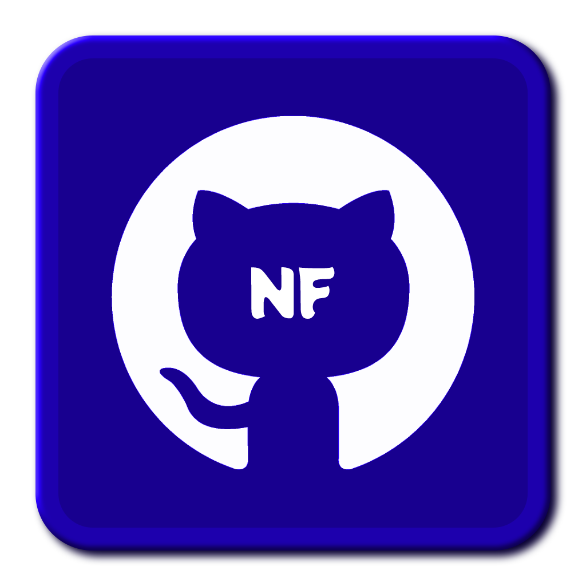

<p align="center">
  <a href="https://beomax1.herokuapp.com" rel="noopener">
 </a>
</p>

<h3 align="center"><a href="https://beomax1.herokuapp.com/">GH-Notify</a></h3>

<div align="center">
  
  <a href="https://github.com/Muhammed-Rahif/GH-Notify/issues">
    
  </a>
  <a href="https://github.com/Muhammed-Rahif/GH-Notify/pulls">
    
  </a>
  <a href="/LICENSE">
    
  </a>
  <a href="https://github.com/Muhammed-Rahif/GH-Notify/releases"></a>
  <a href="https://github.com/Muhammed-Rahif/GH-Notify/actions/">
    
  </a>
  <a href="https://github.com/Muhammed-Rahif/GH-Notify/actions/workflows/format-code.yml">
    
  </a>
  <a href="https://www.codefactor.io/repository/github/muhammed-rahif/gh-notify"></a>
</div>

---

<p align="center"> A GitHub notification receiver Telegram Bot.
    <br> 
</p>

<!-- prettier-ignore-start -->
<!-- START doctoc generated TOC please keep comment here to allow auto update -->
<!-- DON'T EDIT THIS SECTION, INSTEAD RE-RUN doctoc TO UPDATE -->
## 📝 Table of Contents

- [🔗 Quick links](#-quick-links)
- [🧐 About](#-about)
- [🏁 Getting Started](#-getting-started)
  - [Prerequisites](#prerequisites)
  - [Installing](#installing)
- [🔧 Running the tests](#-running-the-tests)
  - [Coding style tests](#coding-style-tests)
- [⛏️ Built Using](#-built-using)
- [✍️ Authors](#-authors)
- [🎉 Acknowledgements](#-acknowledgements)

<!-- END doctoc generated TOC please keep comment here to allow auto update -->
<!-- prettier-ignore-end -->

## 🔗 Quick links

-   [**Get started**](https://beomax1.herokuapp.com/)
-   [**Telegram bot ( _@Beomax_bot_ )**](https://t.me/Beomax_bot)
-   [**GitHub pages**](http://rahif.me/GH-Notify/)

## 🧐 About

A github notification sending server, on telegram.

What if you get your github notifications on telegram instantly. Are you looking for something just like this. Then I will definitely help you. Register your github personal access token with us.. So I can remind you when your notifications comes... Let's get started from [here](https://beomax1.herokuapp.com/)! **It's completely free!**

## 🏁 Getting Started

These instructions will get you a copy of the project up and running on your local machine for development and testing purposes.

### Prerequisites

What things you need to install the software and how to install them.

1. [Git](https://git-scm.com/downloads)
1. [Node Js](https://nodejs.org/en/download/)
1. [Yarn Package Manager](https://yarnpkg.com/getting-started/install)

### Installing

A step by step series of examples that tell you how to get a development env running.

Firstly install the required packages

```
yarn build
```

And start the local server

-   Development
    ```
    yarn devStart
    ```
-   Production
    ```
     yarn start
    ```

Go to http://localhost:5000 (By default) to view the output.

**_Note : The client section (React) files lives in [`src/client`](https://github.com/Muhammed-Rahif/GH-Notify/tree/main/src/client) folder!_**

## 🔧 Running the tests

<!-- To run the tests :-

```
yarn test
``` -->

### Coding style tests

-   To check any files need to be formatted

```
yarn check-format
```

-   To format all required files

```
yarn code-format
```

## ⛏️ Built Using

-   [MongoDB](https://www.mongodb.com/) - Cross-platform document-oriented database program
-   [Express](https://expressjs.com/) - Web framework for Node.js
-   [ReactJs](https://reactjs.org/) - A JavaScript library for building user interfaces
-   [NodeJs](https://nodejs.org/en/) - Node.js® is a JavaScript runtime

## ✍️ Authors

-   [@Muhammed-Rahif](https://github.com/Muhammed-Rahif) - Idea & The whole job so far

See also the list of [contributors](https://github.com/Muhammed-Rahif/GH-Notify/contributors) who participated in this project.

## 🎉 Acknowledgements

-   [@octokit/rest](https://octokit.github.io/rest.js/) - GitHub REST API client for JavaScript
-   [telegraf](https://telegraf.js.org/) - Modern Telegram Bot Framework for Node.js
-   [picocss](https://picocss.com/) - Minimal CSS Framework for semantic HTML
